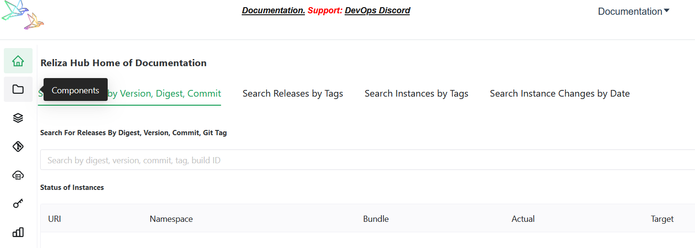
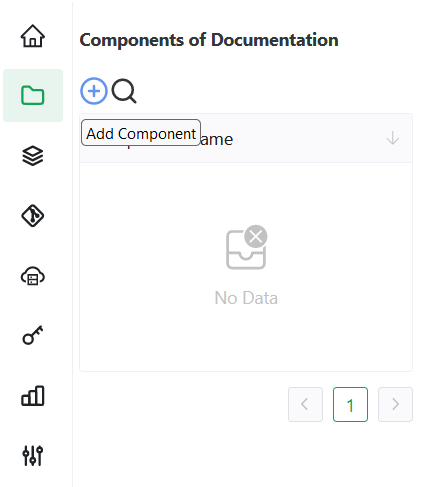

# Getting Started

## Installation of ReARM Community Edition
Open-source ReARM Community Edition (Licensed per AGPL 3.0) may be deployed using Docker Compose or via Helm Chart.

### Local Installation Via Docker Compose
Time it takes: 5 minutes.
Pre-requisites: You need to have an operational Docker engine on your local machine.
This section will be updated later.

### Installation Via Helm Chart
Time it takes: 5 minutes.
Pre-requisites: You need to have a running Kubernetes cluster.
This section will be updated later..

## Create Your Administrative User and Log In
Time it takes: 5 minutes.
Pre-requisites: Installed ReARM via Docker Compose or a Helm chart.

User management is done via Keycloak. To create your first user, navigate to the Keycloak login path at your ReARM URI with `/kauth/` suffix. In example, for the base local docker compose installation this would be `http://localhost:8081/kauth/` .

Log in with default Keycloak credentials defined in docker compose or Helm configuration. The defaults provided by Reliza if you have no local modifications are `admin / admin`.

In the upper left part of the screen, switch realm from Keycloak to Reliza. Click on `Users`, then `Add user`. Set `Email verified` to on, enter your email and optionally First and Last Name and click 'Create'.

Then click on `Credentials` tab and click `Set password`. Enter your desired password and set `Temporary` to `Off`, then click 'Save'.

Your user is now created. Sign out of Keycloak by clicking on `admin` user name in the top right and selecting `Sign out`. Then navigate to the home URI of your ReARM installation - default for docker compose is `http://localhost:8081`.

From there, sign in with the new user account you just created. On the first sign in the system will prompt you to perform unseal procedure. For this enter unseal secret from the ReARM application settings. The default provided by Reliza and used by Docker Compose installation is `r3liza`. The Helm chart installation will generate random secret on installation as noted in the Helm installation section above.

Once you sign in and unseal the system, your user will automatically become the system administrator and the admin of the pre-created organization.

## Create First Component
Once your first organization is created, select `Components` from the menu on the left.

Once on the Components page, click on the `plus-circle button` to Add Component.

In the following form:
- Enter desired name for your component - for the purpose of this tutorial we will call it *Test Component 1*.
- Select main branch name (*main* or *master*). We will use *main* in this tutorial.
- Choose version schema for the component from the suggested options or set a custom one - refer to [Reliza Versioning](https://github.com/relizaio/versioning) for options. We will use *semver* in this tutorial.
- If a separate marketing version is needed, toggle corresponding switch and choose marketing version schema from the suggested options or set a custom one
- Choose version schema for feature branches from the suggested options or set a custom one - refer to [Reliza Versioning](https://github.com/relizaio/versioning) for options
- Choose `Add new repository` in the `Select VCS Repo` field and input URL of your base Version Control Repository. If it is hosted on GitHub.com, GitLab.com or Bitbucket.org, it will be parsed automatically, otherwise you would need to input additional data in the required fields. Click `Create VCS Repository` once everything looks right.
- Click `Submit` to finalize creation of the component.

## Create Your First Component Release
When you created your component, its main branch was created automatically by ReARM and you are seeing the *main* branch view that currently has no Releases.

To create your first Release, in the Branch view on the right part of the screen, click on the `plus-circle button`.