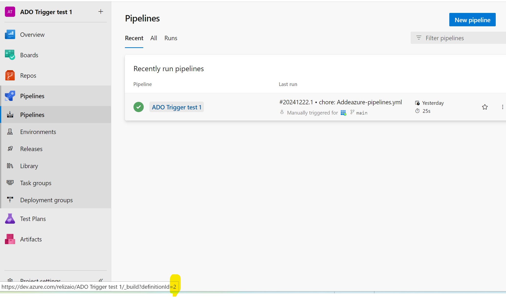

# Trigger Azure DevOps Pipeline from ReARM

N.B. This functinality is not part of ReARM Community Edition and is only available on ReARM Pro.

## Azure Part
1. You would need to create Azure Service Principal to perform Azure DevOps trigger operations. For this, in Azure Portal search, search for `App registrations`, click on it and once on the `App registrations` page, click on the `New registration` button.

2. Choose a name for your Service Principal, opt for Single Tenancy - "Accounts in this organizational directory only" (default value) and click `Register` on the bottom.

3. On the registered Service Principal page, note `Application (client) ID` and `Directory (tenant) ID` - you will need these values later in the ReARM configuration part.

4. On the same page, under *Client credentials* click on the `Add a certificate or secret`. Then click on the `New client secret`. Enter desired secret description, i.e. `ReARM Integration`, choose desired expiration timeframe and click `Add`. On the next page, note created secret value - you will need it later.

5. In Azure DevOps, in your git repository, create your desired pipeline by creating `azure-pipelines.yml` file. The most basic *hello-world* pipeline may look as following:

```
stages:
- stage: Build
  jobs:
  - job: Build
    pool:
      vmImage: 'ubuntu-latest'
    steps:
    - script: echo "hello world"
```

6. Commiting an `azure-pipelines.yml` would create a pipeline, open the `Pipelines` menu in Azure DevOps to view it. 

7. From the `Pipelines` menu, hover with mouse over pipeline name and note definition id as shown on the image below, alternatively, right click pipeline name and select `Copy link address`, then paste the link somewhere and inspect definition id. You would need this definition id (or pipeline id) later in the ReARM configuration part.



In the image above, the definition (pipeline) ID would be `2`.

8. Also, in Azure DevOps, note your organization name and your project name. You would need both of these in the ReARM configuration steps.

9. In Azure DevOps, click on your organization name, click on the `Organization Settings` in the bottom left corner, click on `Permissions` under *Security*, then click on the `Project Collection Build Service Accounts`. Click on `Members`, click `Add` and search for the Service Principal you created above, click on it, then click on `Save`.

Note, that you may want to refine these permissions based on your organization policies. Setting Azure permissions may be quite complex, if you need to tune permissions, start with the base documentation [here](https://learn.microsoft.com/en-us/azure/devops/integrate/get-started/authentication/service-principal-managed-identity?view=azure-devops).


## ReARM Part

Note that for integration triggers firing on approval policy events, you would need an Approval Policy configured; for firing on vulnerabilities or policy violations, you would need [Dependency Track integration configured](./dtrack).

### Organization-Wide CI Integration Part (requires Organization Admin permissions)

1. In ReARM, open **Organization Settings** menu. Under **Integrations** tab, in the `CI Integrations` sub-section, click on `Add CI Integration`.

2. Enter description (try to make this descriptive as this will be used to identify integration).

3. Choose `Azure DevOps` as CI Type. 

4. Enter your App (client) Id noted above in the `Client ID` field.

5. Enter your Client Secret noted above in the `Client Secret` field.

6. Enter your Directory (tenant) Id noted above in the `Tenant ID` field.

7. Enter your Azure DevOps Organization name noted above in the `Azure DevOps Organization Name` field.

8. Click `Save`. Your CI Integration is now created.


### Component Part (requires User with Write permissions)

1. You need to set up a ReARM component that will have corresponding triggers configured. Once your component is created, open it and click on the tool icon to toggle component settings:


2. If you are setting triggers based on approvals, make sure you have Approval Policy selected under **Core Settings** tab.

3. Open **Output Triggers** tab and click on `Add Output Trigger`.

4. Enter name for your trigger, i.e. `Trigger Azure DevOps Pipeline`.

5. Select `External Integration` as *Type*.

6. Choose your previously created Azure DevOps Integration in the `Choose CI Integration` field.

7. Enter your Azure DevOps Project Name as noted above in the `Azure DevOps Project Name` field.

8. Enter your Azure DevOps Pipeline Definition ID as noted above in the `Pipeline Definition ID` field.

9. If needed, enter Optional Parameters json values, that contain Azure variables and may be set as JSON and be distributed as `parameters` in Azure call as described in Azure API documentation [here](https://learn.microsoft.com/en-us/rest/api/azure/devops/build/builds/queue?view=azure-devops-rest-7.1).

In example, this may be set to

```
{"param1":  "value1", "param2":  "value2"}
```

You may also use predefined variable `$releaseversion` to pass triggering release version, in example this can be:

```
{"myparam": "$releaseversion"}
```

With sample pipeline may be looking as:


```
parameters:
  - name: myparam
    type: string
    default: myvaldefault    

stages:
- stage: Build
  jobs:
  - job: Build
    pool:
      vmImage: 'ubuntu-latest'
    steps:
      - bash: echo ${{ parameters.myparam }}
```

Note that if using optional parameters, your pipeline must declare these parameters in the `parameters` block, otherwise runs will result in errors.

10. Click on 'Save', your trigger is now created.

11. Now create a Trigger Event linked to this trigger to make it fire on desired events (TODO - to be documented soon).