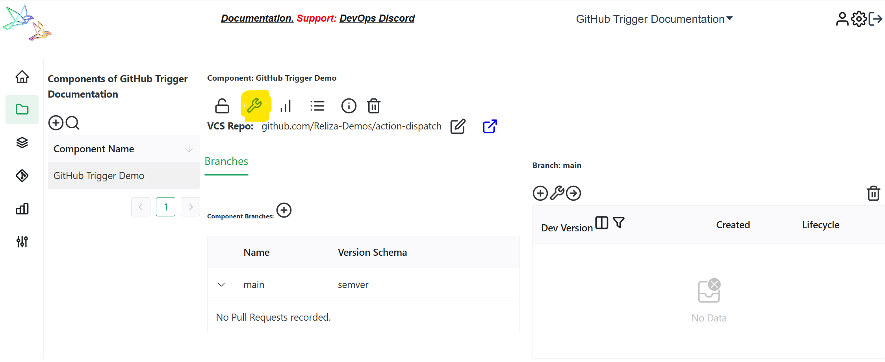

# Trigger GitHub Actions Workflow from ReARM

N.B. This functinality is not part of ReARM Community Edition and is only available on ReARM Pro.

## GitHub Part
1. You need to register a GitHub application that would trigger events in your repositories. To do so, refer to instructions [here](https://docs.github.com/en/apps/creating-github-apps/registering-a-github-app/registering-a-github-app#registering-a-github-app).

Leave most values at their defaults, uncheck `Active` on Webhook, and set the following permissions:
Repository Permissions -> Contents -> Access: Read and write.

Select to install for only this account or other accounts as well based on your organization needs.

2. Once the GitHub App is created, note its App ID.

3. Generate App Private Key as suggested by GitHub (on the home page of your app scroll down to the `Private keys` section and click on `Generate a private key`). A .pem file would be downloaded onto your machine.

4. From your bash terminal, perform the following commands on this .pem file (I would assume the file to be named `key.pem` for the commands below):

```
openssl pkcs8 -topk8 -inform PEM -outform DER -in key.pem -out key.der -nocrypt
base64 -w 0 key.der
```

Note the output, you would need it to paste into ReARM integration form.

5. In your browser, from the home page of your GitHub App, click on the `Install App` and install it for desired Account(s) and repository or repositories.

Once installed, the App would display installation ID in the browser address bar as shown on the image below.


Note this installation ID for adding into ReARM integration form later.

6. Create a desired GitHub Actions script in your repository which would fire on repository dispatch event, i.e.

```
on:
  repository_dispatch:
    types: [reliza-build-event]
```

See sample script [here](https://github.com/Reliza-Demos/action-dispatch/blob/main/.github/workflows/workflow.yml).

This script must be present on the main branch of your repository as GitHub Actions does not support branch selection for triggers.

Note that the event type is optional, and you can choose any event and configure it on ReARM.

In your script, you may also make use of client payload as described in the GitHub Documentation [here](https://docs.github.com/en/actions/writing-workflows/choosing-when-your-workflow-runs/events-that-trigger-workflows#repository_dispatch). For this, add payload JSON to the `Optional Client Payload JSON` field in ReARM's output trigger. For example, to pass approved release version to GitHub Actions, you can use the following JSON:

```json
{"approvedRelease": "$releaseversion"}
```

Then in the workflow, you can access the payload using `github.event.client_payload.approvedRelease`. See full sample [here](https://github.com/relizaio/rearm-cd/blob/main/.github/workflows/watcher-helm-approved.yml).

## ReARM Part

Note that for integration triggers firing on approval policy events, you would need an Approval Policy configured; for firing on vulnerabilities or policy violations, you would need [Dependency Track integration configured](./dtrack).

### Organization-Wide CI Integration Part (requires Organization Admin permissions)

1. In ReARM, open **Organization Settings** menu. Under **Integrations** tab, in the `CI Integrations` sub-section, click on `Add CI Integration`. 

2. Enter description (try to make this descriptive as this will be used to identify integration).

3. Choose `GitHub` as CI Type. 

4. Paste your Base64-encoded key noted above in the `GitHub Private Key DER Base64` field.

5. Enter your GitHub App noted above in the `GitHub Application ID` field.

6. Click `Save`. Your CI Integration is now created.

### Component Part (requires User with Write permissions)

1. In ReARM, make sure you register your VCS repository that contains desired GitHub Actions script either via Component creation or via **VCS** menu item and the plus-circle icon.

2. You need to set up a ReARM component that will have corresponding triggers configured. Once your component is created, open it and click on the tool icon to toggle component settings:


3. If you are setting triggers based on approvals, make sure you have Approval Policy selected under **Core Settings** tab.

4. Open **Output Triggers** tab and click on the `plus-circle icon` in the bottom left (Add Output Trigger).

5. Enter name for your trigger, i.e. `Trigger GitHub Actions Approval Workflow`.

6. Select `External Integration` as *Type*.

7. Choose your previously created GitHub Integration in the `Choose CI Integration` field

8. Enter your GitHub App's Installation ID as noted above.

9. Enter name of your GitHub Actions event as referenced in your GitHub Actions script (the event name used in these instructions was `reliza-build-event`).

10. If you require any additional client payload, enter it in the JSON format in the *Optional Client Payload JSON* field.

For example, input: `{"product_version": "$releaseversion"}` to pass the release version on which the trigger fired to the GitHub Actions workflow.

11. Optionally, you can set a *Dynamic client payload (CEL string expression)* instead of — or in addition to — the static JSON above. This is a [CEL](https://cel.dev/) expression evaluated against the release at the moment the trigger fires; when set, the evaluated result **overrides** the *Optional Client Payload JSON* field before delivery.

    **When to reach for it.** The static field already supports the `$releaseversion` placeholder, so for a simple `{"version": "<release-version>"}` you do not need CEL — `{"version": "$releaseversion"}` in the static field does the same thing. CEL earns its keep when the payload needs to depend on conditional logic or fields the placeholder system doesn't expose (lifecycle, vulnerability counts, approval state, head-commit metadata, etc.).

    **Format rules** — the same as the static field, because the evaluated string is then JSON-parsed and sent as the GitHub `client_payload`:
    - The expression must produce a **JSON object string** (top-level `{...}`).
    - All values must be flat strings — nested objects, arrays, or non-string scalars cause the JSON parse to fail and the trigger silently falls back to the static field (the failure is logged on the server side at `WARN`).
    - **Don't use CEL's `{}` literal syntax** — `{"version": release.version}` evaluates to a CEL map and stringifies to Java's `{version=0.5.0}` form, which is not valid JSON. Build the JSON string by concatenation instead.

    **Sample expressions:**

    ```cel
    // Build a JSON object the consuming workflow can read
    '{"version": "' + release.version + '"}'
    ```

    ```cel
    // Multi-field, with a conditional value
    '{"ref": "refs/tags/' + release.version + '", "skip_tests": "'
       + (release.criticalVulns > 0 ? 'true' : 'false') + '"}'
    ```

    **Fields exposed to the expression** (under `release.*`):
    - `release.version`, `release.lifecycle`, `release.component`, `release.branchType`
    - vulnerability counts: `release.criticalVulns`, `release.highVulns`, `release.mediumVulns`, `release.lowVulns`, `release.unassignedVulns`, `release.firstScanned`
    - policy violations: `release.securityViolations`, `release.operationalViolations`, `release.licenseViolations`
    - approvals: `release.anyApproved`, `release.anyDisapproved`, `release.approvals["<entry-uuid>"]` returning `"APPROVED" | "DISAPPROVED" | "UNSET"`. `approvals` is also a top-level alias so macros like `approvals.exists(k, approvals[k] == "DISAPPROVED")` work.
    - context: `release.agentSessions`, `release.commits`, `release.headCommit`

    **Reading the payload in the GitHub Actions workflow** — identical to the static-field case. The trigger fires GitHub's [`repository_dispatch`](https://docs.github.com/en/webhooks/webhook-events-and-payloads#repository_dispatch) event with body `{"event_type": "<your event>", "client_payload": <parsed-map>}`:

    ```yaml
    name: react-to-rearm

    on:
      repository_dispatch:
        types: [reliza-build-event]      # must match step 9

    jobs:
      build:
        runs-on: ubuntu-latest
        steps:
          - name: Show payload
            run: |
              echo "version=${{ github.event.client_payload.version }}"
              echo "ref=${{ github.event.client_payload.ref }}"

          - name: Checkout the tag the trigger pointed at
            uses: actions/checkout@v4
            with:
              ref: ${{ github.event.client_payload.ref }}

          - name: Conditional skip
            if: github.event.client_payload.skip_tests != 'true'
            run: ./gradlew test
    ```

    Each key from the payload map is accessed as `github.event.client_payload.<key>`; values arrive as strings since the server sends a flat string-to-string map.

12. Under *CI Repository* click on the Edit icon and select your GitHub repository containing desired GitHub Actions workflow set up above.

13. Click on 'Save', your trigger is now created.

14. Now create a Trigger Event linked to this trigger to make it fire on desired events (TODO - to be documented soon).