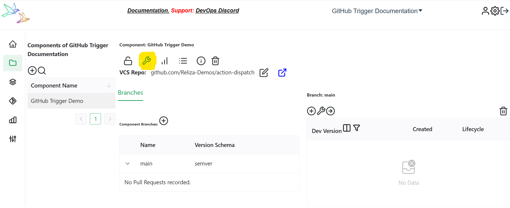

# Trigger Jenkins Pipeline from ReARM

N.B. This functinality is not part of ReARM Community Edition and is only available on Enterprise Edition.

## Jenkins Part

1. Install *Build Authorization Token Root* plugin - https://plugins.jenkins.io/build-token-root/

2. In the *Build Triggers* section of your job check *Trigger builds remotely (e.g. from scripts)* and paste random alphanumeric sequence into the Authentication Token field. 


Note: To generate the token you may use the following CLI command:

```
openssl rand 32 | base64
```

Remember this token for now for future input in the ReARM configuration form.

3. Under the *Authentication Token* section note the url that Jenkins will print out to trigger this build remotely. Copy that url and modify it to match *Build Authorization* plugin format as following:

Example: if your Jenkins host is *https://my.jenkins* and Jenkins gives you the following URI:

```
JENKINS_URL/job/Test%20pipeline/build?token=TOKEN_NAME
```

the final URI you are looking for is

```
https://my.jenkins/buildByToken/build?job=Test%20pipeline&token=
```

Note that we are using *buildByToken* endpoint as provided by the *Build Authorization Token Root* plugin. Without this the basic API path is actually not operational on Jenkins.

! Important: Do not include your actual token in the URL, it would go in a separate field on ReARM side.

## ReARM Part

1. Integration triggers on approval policy events, for which you would need an Approval Policy configured or on vulnerabilities or policy violations, for which you need [Dependency Track integration configured](./dtrack).

2. You need to set up a ReARM component that will have corresponding triggers configured. Once your component is created, open it and click on the tool icon to toggle component settings:


3. If you are setting triggers based on approvals, make sure you have Approval Policy selected under **Core Settings** tab.

4. Open **Output Triggers** tab and click on `Add Output Trigger`.

5. Enter name for your trigger, i.e. `Trigger Jenkins`.

6. Select `External Integration` as *Type* and `Jenkins` as *Sub-Type*.

7. Enter your Jenkins alphanumeric token as created and noted above.

8. Enter your Jenkins URI as composed above.

9. Click on 'Save', your trigger is now created.

10. Now create a Trigger Event linked to this trigger to make it fire on desired events (TODO - to be documented soon).