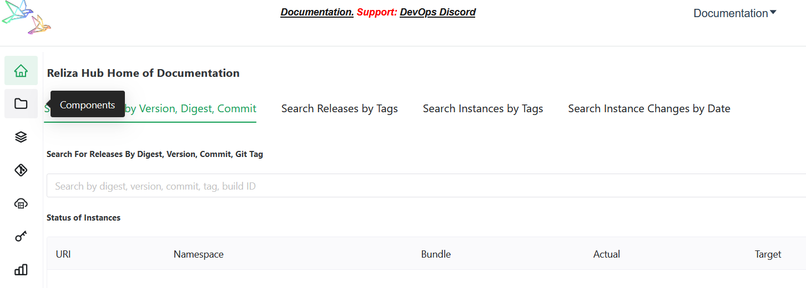
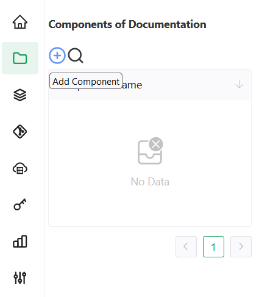

# Upload Your First BOM

This tutorial will walk you through uploading your first Bill Of Material to ReARM manually. For the automated way refer to other tutorials and [ReARM CLI documentation](https://github.com/relizaio/rearm-cli).

Time it takes: 10 minutes.

## Pre-requisites
1. Make sure you have [installed](/installation/) ReARM Community Edition or have access to ReARM Enterprise. Alternatively, you can follow this steps on [ReARM Public Demo instance](https://demo.rearmhq.com). If using Public Demo, click on Profile (Human icon) in the top right of the screen, and then Create New Organization in which you would do subsequent steps. Reload the page (F5) once the organization is created, this will show the dropdown menu on top of the screen where you can switch into your new organization.

2. Optionally, but highly recommended is to set up [Dependency-Track](https://dependencytrack.org/) integration. ReARM relies on Dependency-Track for SBOM analysis, including vulnerability scans and policy violations. If you are using ReARM Enterprise Edition, Dependency Track integration will be set up for you by Reliza. If you are using Community Edition or your organization on Public Demo, follow [these instructions on setting up Dependency-Track integration](/integrations/dtrack).

3. You need to have a CycloneDX xBOM document ready. If you don't have one, you can use one of [our samples](https://github.com/relizaio/rearm-cli/tree/main/bom_samples).

## Create First Component
Once your organization is set up, select `Components` from the menu on the left.

Once on the Components page, click on the `plus-circle button` to Add Component.

In the following form:
- Enter desired name for your component - for the purpose of this tutorial we will call it *Test Component 1*.
- Select main branch name (*main* or *master*). We will use *main* in this tutorial.
- Choose version schema for the component from the suggested options or set a custom one - refer to [Reliza Versioning](https://github.com/relizaio/versioning) for options. We will use *semver* in this tutorial.
- If a separate marketing version is needed, toggle corresponding switch and choose marketing version schema from the suggested options or set a custom one
- Choose version schema for feature branches from the suggested options or set a custom one - refer to [Reliza Versioning](https://github.com/relizaio/versioning) for options
- Choose `Add new repository` in the `Select VCS Repo` field and input URL of your base Version Control Repository. If it is hosted on GitHub.com, GitLab.com or Bitbucket.org, it will be parsed automatically, otherwise you would need to input additional data in the required fields. Click `Create VCS Repository` once everything looks right.
- Click `Submit` to finalize creation of the component.

## Create Your First Component Release
When you created your component, its main branch was created automatically by ReARM. Click on it and you will see the *main* branch view that currently has no Releases.

To create your first Release, in the Branch view on the right part of the screen, click on the `plus-circle button`.

ReARM would propose auto-assigned version based on your versioning schema selected for the Component and for the Branch. You may agree with this schema and click on Create Release or you may override it. Note that each version must be unique across the component.

Click on `Create Release` to create your release. Release will now show up in the Branch view.

## Adding SBOM to release

In ReARM, xBOMs may belong to whole releases, Source Code Entries (commits) or Deliverables (such as produced container images). Below, we will upload BOM artifact to the whole release we just created.

Click on the version of just created release - this will open Release View. In there, click on `Plus-Circle Icon` near `Artifacts`. 

Choose `ReARM` as storage type. Upload your CycloneDX BOM file.

Input Display Identifier, this can be file name or URI.

Chose `BOM` as Artifact Type and `CYCLONEDX` as Bom Format.

Optionally, you may add Tags, Identities and Digests.

Click `Add Artifact`.

Your artifact is now uploaded and will show up in the artifacts section of your Release.

If you have Dependency-Track integration configured, in about a minute if you reload a Release, you would see results of Vulnerability and Policy Violation scan and a link to open the corresponding Dependency-Track project.

## Congratulations!
You have uploaded your first BOM to ReARM!