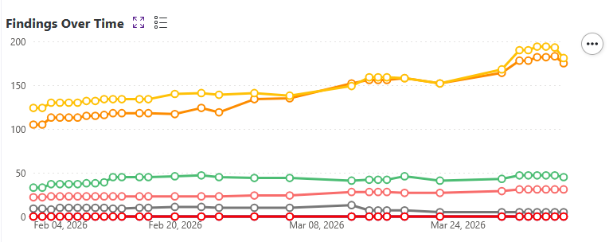
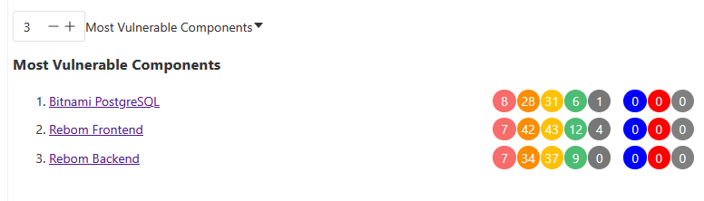
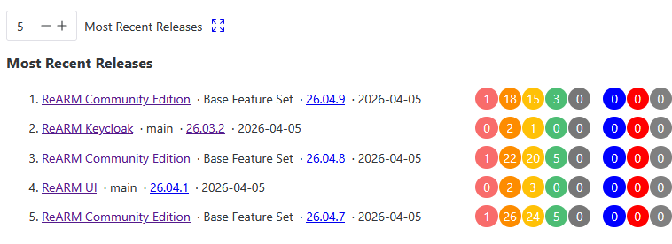
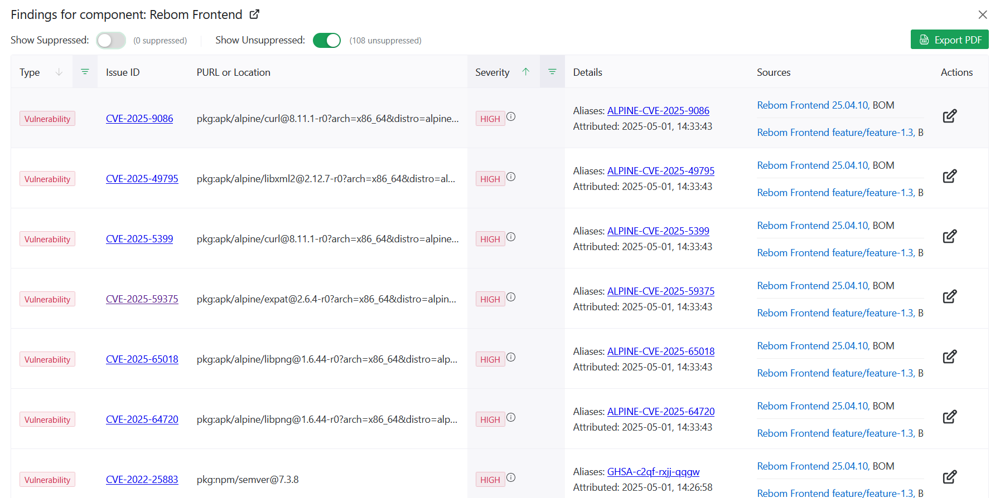
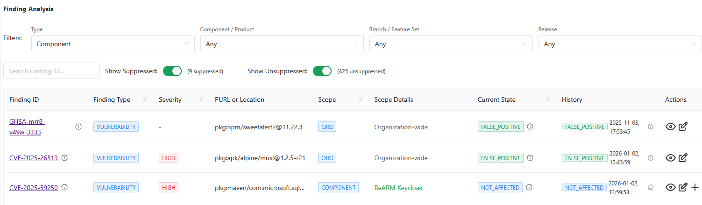
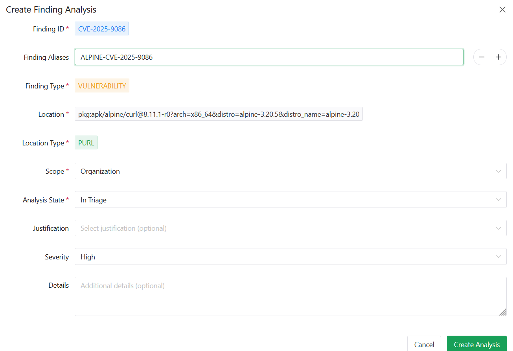

# Auditing Findings

## Description

ReARM aggregates security and compliance findings from your release artifacts and provides a structured workflow to triage, document, and suppress them. Findings are grouped into three types:

- **Vulnerability** - a known CVE or security vulnerability in a dependency
- **Violation** - a policy violation (license, security, or operational) detected by Dependency-Track
- **Weakness** - an integration or a code-level weakness identified for example by a SAST or DAST tool (CWE-based)

This page covers how to view, triage, and manage all finding types. For license-specific setup and viewing, see [License Compliance](./license-compliance).

## Where Findings Appear

### Overview

Findings are displayed in multiple places throughout the ReARM interface to provide comprehensive visibility and management capabilities. Usually findings are shown per release or per artifact using colored circles. Each component row displays colored circles for:

- Critical / High / Medium / Low / Unassigned vulnerabilities
- License violations
- Security violations
- Operational violations

Click any circle to open the **Findings Modal** for that release or artifact, pre-filtered to the selected severity or violation type.

### Dashboard (Home)

The Home dashboard shows findings in several locations:

1. **Findings Over Time** - Shows the trend of findings over time for the whole organization. Findings here are shown using a line chart with points for each day. Points are clickable and would open the **Findings Modal** for that specific day filtered by the selected severity or violation type.

2. **Most Vulnerable Components Widget** - Shows the components with the highest finding counts in your organization. 

3. **Most Recent Releases Widget** - Shows the most recent releases in your organization.

### Findings Modal

The Findings Modal is accessible from release views, component views, and the dashboard. It shows a combined table of all findings for a given scope. Each row includes:

- **Type** tag - Vulnerability, Violation, or Weakness
- **Issue ID** - CVE ID, CWE ID, or violation type (i.e. "LICENSE") - linked to the upstream advisory where applicable
- **PURL or Location** - [PURL](https://github.com/package-url/purl-spec) of the dependency or code location
- **Severity** tag (for vulnerabilities and weaknesses)
- **Details** - additional details about the finding, including aliases alternative IDs (e.g., GHSA aliases for CVEs), reported License for License violations
- **Sources** - list of sources that reported the finding (specific Releases and Artifacts where finding was discoverd)

Suppressed findings (state `FALSE_POSITIVE` or `NOT_AFFECTED`) are shown as strikethrough and may be hidden via filters

Use **Export PDF** to generate a downloadable report.

### Changelogs

Findings are present in various changelogs across the application, including:

- Release changelogs
- Component changelogs
- Organization-wide changelog on the home page
- Perspective-wide changelog on the home page (ReARM Pro only)

### Finding Analysis Page

The **Finding Analysis** page (accessible from the main navigation using the bug icon) provides a centralized table of all analysis records. Use this view to audit triage progress and manage findings across all components, branches, and releases. This table may be filtered by component, branch, release, or perspective (ReARM Pro only).

## Auditing (Triaging) Findings (Creating an Analysis)

To triage a finding, create a **Finding Analysis** record. This documents your organization's assessment of the finding and optionally suppresses it from active counts.

ReARM supports multiple analysis records for the same finding per different scopes. A broader scope covers all narrower scopes within it. When filters are active in the Finding Analysis view, only the scopes that do not already have an analysis record are offered when creating a new one. Those scopes are:

| Scope | Applies To |
|---|---|
| **Organization** | All components and releases in the org |
| **Component / Product** | All branches and releases of a specific component |
| **Branch / Feature Set** | All releases on a specific branch |
| **Release** | One specific release only. Note, however, that this would propagate accordingly to any bundle that this release is a part of |

A **Finding Analysis** record can be created from the Findings Modal or from the Finding Analysis page.

1. Creating from the Findings Modal
   - Click the **edit icon** next to any finding in the Findings Modal. This opens the "Finding Analysis Records" dialog. It may have existing records if previuos analysis were made for this specific issue ID and location. If such records exist you may click on the edit icon in the Actions column to update analysis. Note that previous analysis would be preserved as well for audit purposes.
   - If there are available scopes, you will see Add Scope button at the bottom of the dialog. Click it to add a new scope to the analysis.
2. Creating from the Finding Analysis page
   - In the Finding Analysis page, available scopes are based on the filters selected for findings. I.e., if no filters are chosen for Component/Product, you will only have access to Organization-wide scope. If filters are chosen for Component/Product, you will have access to this specific Component or Product and Organization-wide scopes. If filters are chosen also for Branch/Feature Set, you will have access to this specific Branch/Feature Set, Component/Product and Organization-wide scopes. If filters are chosen also for Release, you will have access to this specific Release, Branch/Feature Set, Component/Product and Organization-wide scopes.
   - Click the **edit icon** next to any finding in the Finding Analysis view. If no analysis exists yet, this opens the **Create Finding Analysis** dialog. If an analysis already exists, it opens the **Update** dialog. If an analysis exists and there are available scopes, you will see **plus icon** next to the analysis record. Click it to add a new scope to the analysis.

### Analysis Fields

When creating or updating a finding analysis, you will be able to work with the following fields:

| Field | Description |
|---|---|
| **Finding ID** | The CVE, CWE, or violation identifier - pre-filled, read-only |
| **Finding Aliases** | Alternative IDs - pre-filled from SBOM data, editable |
| **Finding Type** | `VULNERABILITY`, `VIOLATION`, or `WEAKNESS` - pre-filled |
| **Location** | PURL of the affected dependency or code path - pre-filled |
| **Location Type** | `PURL` or `CODE_POINT` - auto-detected |
| **Scope** | Level at which the analysis applies (see below) |
| **Analysis State** | Your triage decision (see below) |
| **Justification** | Reason for the decision - may be mandatory (see Admin Settings) |
| **Severity** | Optional severity override |
| **Details** | Free-form notes |

### Analysis States

| State | Tag Color | Meaning |
|---|---|---|
| **In Triage** | Warning | Under review, no decision yet |
| **Exploitable** | Error | Finding is confirmed and actively exploitable |
| **False Positive** | Success | Finding does not apply, should not have been reported in the first place - **suppresses** the finding |
| **Not Affected** | Info | Component is not affected - **suppresses** the finding |

Findings in `FALSE_POSITIVE` or `NOT_AFFECTED` state are **suppressed** and excluded from active finding counts.

## Managing Existing Analysis Records

From the **Finding Analysis** view, each record can be:

- **Updated** - change state, justification, severity, or details via the edit icon
- **Expanded** - view the full history of state changes, each with timestamp, state, justification, severity, and details

For **Vulnerability** type findings, an additional **eye icon** allows you to view all releases in the organization affected by the same CVE, helping prioritize remediation.

## Filtering the Finding Analysis View

The Finding Analysis view supports the following filters:

- **Type** - Vulnerability, Violation, or Weakness
- **Component / Product** - filter to a specific component or product
- **Branch / Feature Set** - filter to a specific branch
- **Release** - filter to a specific release version
- **Finding ID search** - free-text search across finding IDs and aliases
- **Show Suppressed** toggle - include or exclude suppressed findings
- **Show Unsuppressed** toggle - include or exclude active findings

When component, branch, or release filters are active, the view also surfaces **new findings** from those release artifacts that have not yet been analyzed, allowing you to triage them inline.

## Admin Settings

Organization admins can configure the following under **Org Settings → Admin Settings**.

### Justification Mandatory

Enable **Justification Mandatory** to require users to select a justification when creating any finding analysis. When enabled, the justification field becomes required in the Create Analysis dialog.

### Violation Ignore Patterns

Configure regex patterns to automatically exclude specific violations from all reports:

- **License Violation Ignore Patterns** - matched against license identifiers, refer to [License Compliance](./license-compliance.md) for more details
- **Security Violation Ignore Patterns** - matched against security violation details
- **Operational Violation Ignore Patterns** - matched against operational violation details

Any violation matching a configured pattern is excluded organization-wide. Click **Save Ignore Patterns** to apply.

