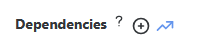
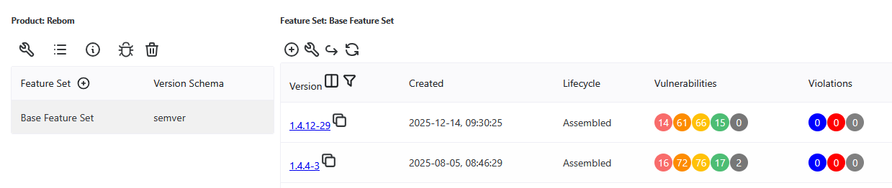
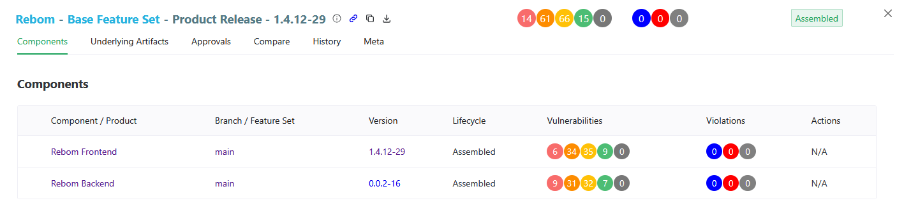
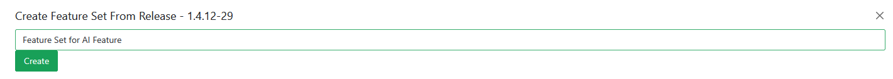
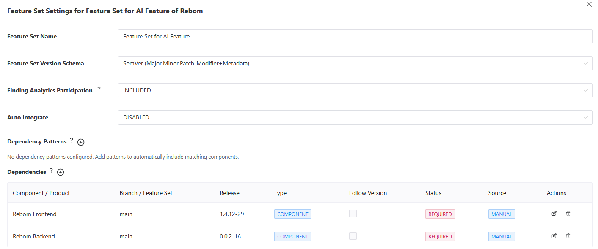

# Bundling & Auto-Integrate

## Description
Bundling is a process of *integrating* several Components into a single Product. A Product release stores versions of all individual Components and can be used as a single manifest in the upgrade process.

## Create Product
To create a Product, navigate to the `Product` menu of ReARM and click on the `plus-circle icon`.

Choose desired name and version schema. 

Once created, ReARM would automatically provision *Base Feature Set* for this product.

## Set up Auto-Integrate
Once product is provisioned, you may set up auto-integration logic of Component releases into Product releases. For this, select desired *Feature Set* and click on the `wrench icon`.

### Dependency Patterns
Dependency Patterns allow automatic matching of components based on Java regex patterns. This is useful for dynamically including components without manually adding each one.

To add a pattern, click `Add Pattern` button and enter a Java regex pattern. For example:
- `^myapp-.*` matches all components starting with "myapp-"
- `.*-service$` matches all components ending with "-service"
- `^(frontend|backend|api)$` matches exactly "frontend", "backend", or "api"

Pattern-matched dependencies are automatically included in auto-integrate when their releases arrive.

### Manual Dependencies
To add specific components, click `Add Component Dependency` or `Add Product Dependency` button. Select the desired component/product and branch. Optionally, pin a specific release for the auto-integrate.

### Dependency Management
All dependencies (pattern-matched and manual) appear in the *Dependencies* table. You can:
- **Edit** any dependency to change branch, release, status, or follow version
- **Pin releases** to specific versions for controlled integration
- **Set Follow Version** on one dependency to track its version for the Product (only one allowed)
- **Delete** manual dependencies or change their status to IGNORED

### Dependency Status
*Component Requirement Status* can be one of 3 things:
- *Required* - Component is a part of auto-integrate and will also be used for strict matching. This means that ReARM will only recognize this Product if the Component is present.
- *Transient* - Component is a part of auto-integrate but will only be used for matching to Product if it is present at the instance. So if the component is not present on the instance, but all other components are present, ReARM will consider this Product as matching.
- *Ignored* - Component will not be part of auto-integrate, nor of matching. ReARM will completely ignore it if encounters.

### Pattern and Manual Dependency Precedence
When a component matches both a dependency pattern and has a manual entry, the **manual entry takes precedence** in the effective dependencies list.

Editing a pattern-matched dependency automatically creates a manual entry for that component, which then overrides the pattern-matched version. This effectively converts the pattern-matched dependency to manual while the pattern continues to exist and may match other components.

### Branch Suffix Mode
When ReARM auto-integrates a non-base Feature Set, by default it appends the Feature Set name as a suffix to the resolved version (e.g., `1.2.3-feat_login`). *Branch Suffix Mode* controls this suffix behavior. It can be set at two levels:

1. **Organization level** - configured under `Admin Settings → Admin Settings → Branch Suffix Mode`. This sets the default for all Components in the organization.
2. **Component / Product level** - configured on the Component or Product settings screen. Each Component or Product can override the organization default or inherit it.

Available modes:
- **Inherit** (Component or Product level only) - use the organization default.
- **Append** - always append the Feature Set name suffix to non-base releases (e.g., `1.2.3-feat_login`). This is the default behavior.
- **Never Append** - never append a Feature Set suffix. Version conflicts with the Base Feature Set are resolved by appending `-0`, `-1`, `-2`, etc.
- **Append Except when Following Version** - append the suffix unless the Feature Set has a dependency marked as *Follow Version*; in that case, the followed version is used as-is without a suffix.

The per-Component / per-Product setting also shows the currently effective mode (either the explicit Component/Product value, or the inherited organization value). When no organization setting is configured, the system default is *Append*.

#### Which Branch Suffix Mode to Choose

The right mode depends on how you use non-base Feature Sets and whether downstream consumers need to distinguish between releases from different Feature Sets.

- **Append** (default) - Best when Feature Sets represent parallel development streams that may produce releases with overlapping version numbers (e.g., a hotfix branch `1.2.3` and a mainline `1.2.3`). The suffix guarantees globally unique, human-readable versions and makes the originating Feature Set visible directly in the version string. Choose this if you are unsure.

- **Never Append** - Best when versions must stay clean for external consumers (e.g., published libraries, container images with strict tagging rules) and you control branch or feature set versioning so that collisions do not exist or are rare (i.e., if you are already using a technique like the one described [here](https://worklifenotes.com/2019/01/20/semver-in-production-always-keep-separate-production-branch-on-its-own-minor/). If a collision does occur, ReARM tries to auto-resolve it by appending `-0`, `-1`, etc. Avoid this mode if you expect frequent version collisions, as the auto-resolution suffix is less meaningful than a Branch or Feature Set name.

- **Append Except when Following Version** - Best when a Feature Set exists primarily to track an upstream Component version exactly (via *Follow Version*), and you want the Product release to carry that upstream version verbatim. Other Branches and Feature Sets to get suffixed normally. Typical use case: a Feature Set that mirrors a single third-party or vendored Component version. Note, that follow version resolution within the Feature Set when non-followed version Components are changing may still result in version collisions, which are auto-resolved by appending `-0`, `-1`, etc.

General guidance:

- Prefer configuring the mode at the **Organization level** first and only override per Component or Product when needed.

### Enable Auto-Integrate
Once all dependencies are configured, switch *Auto Integrate* selector to *ENABLED*. This ensures that any new incoming component release matching your patterns or manual dependencies will trigger creation of a new version of this *Product*.

Changes to dependencies, patterns, and settings must be saved using the *Save Changes* button that appears when modifications are made.

### Manually Trigger Auto-Integrate
Use `broken arrow icon` to trigger auto-integrate that was just configured. That would create first auto-integrated release if its components are already available.

## Create Feature Set from Product Release
ReARM allows creation of Feature Sets from Product Releases. The main use-case for this is Branching of Product Releases.

Specifically, consider following possible scenarios:

### 1. Requirement to patch a single component
1. You have a Product Release version 2.5.7 deployed somewhere. That release belongs to the Base Feature Set of the Product. The release has 15 components.
2. You already have newer Product Releleases in the same Base Feature Set but you need to do surgical fix for only one of its fifteen Components.
3. To achieve this, you may create a Feature Set from release.

### 2. Creating a new feature using existing Product Release as a baseline
1. In this case consider your newest Product Release version 3.5.0 that lives in your Base Feature Set. It has 20 components.
2. Now you would like to make a new Feature Set to add AI assistance capability across 2 Components out of 20.
3. To achieve this, you may create a Feature Set from release.

When you create a Feature Set from Product Release, it:
1. Creates a new Feature Set with the name you specify
2. And it adds all Components from the Product Release as manual pinned dependencies in the created Feature Set.

For example, consider my Rebom Product with the following releases as on the image below:

You may either use copy icon at the right of the release version. Or here is Release View of the same release:

And you can use copy icon in the Release View header.

Then you just need to enter your desired name in the modal:

And after clicking `Create`, a new Feature Set will be provisioned.

If you open settings for the new Feature Set, you will notice that Component Releases of the original Product Release are now added as auto-integrate dependencies:

Note, that Auto Integrate is configured as `DISABLED` initially. You should then modify dependencies as you see fit and then enable Auto Integrate. If you also need to trigger first release manually at this stage, you can do so using `broken arrow` icon as described above.
