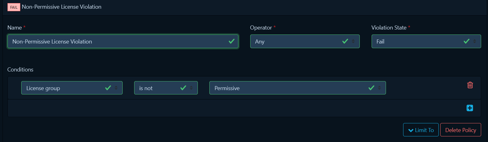
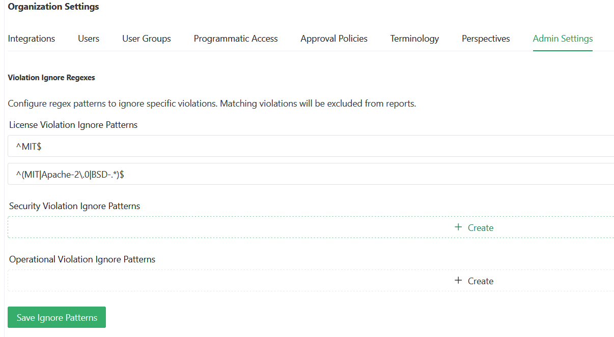

# License Compliance

## Description

ReARM tracks license policy violations detected in your component SBOMs. A license violation occurs when a dependency's license does not comply with a policy defined in your connected [Dependency-Track](https://dependencytrack.org) instance.

License violation data flows into ReARM automatically once Dependency-Track is integrated and a SBOM is uploaded for a release. ReARM stores the violation alongside the release and surfaces it in multiple views. License violation (as any other finding) is propagated to any Product release that this release is a part of.

For information on triaging and auditing, or suppressing license violations (and other finding types), see [Auditing Findings](./auditing-findings).

## SBOM License Enrichment
Reporting licensing violations relies on accurate license information from the SBOM. ReARM uses the [Reliza BEAR](../integrations/bear) integration to enrich license data. For ReARM Pro, Reliza will provide managed BEAR service. For ReARM CE, you can run your own BEAR service or you may use other means for license enrichment.

## Setting Up License Policy in Dependency-Track
License compliance enforcement in ReARM currently relies on Dependency-Track's Policy Compliance feature. Dependency-Track evaluates uploaded SBOMs against configured policies and reports any violations back to ReARM. In the future, ReARM may support other sources of license violation data.

### How Dependency-Track Policy Compliance Works

Dependency-Track allows you to define policies that specify which licenses are permitted, restricted, or forbidden in your projects. When a SBOM is analyzed, each component's license is evaluated against applicable policies. Violations are generated for any component whose license does not comply.

### Guide to Setting Up License Policies in Dependency-Track
*N.B.:* This guide assumes you are using Dependency-Track version 4.x.

Open Dependency-Track and navigate to the ADMINISTRATION -> Policy Management section. Navigate to the "License Groups" tab. Observe that there are already some license groups defined, such as "Permissive Licenses", "Copyleft Licenses", etc. You can create new license groups, or modify existing ones to fit your organization's needs, or use existing groups directly.

Navigate to the "Policies" tab. Here you can create new policies or modify existing ones to define which license groups are permitted, restricted, or forbidden.

For example, let's say you want to create a policy to report any non-permissive license is a violation. For this:

- Click the "Create Policy" button
- Give the policy a name, such as "Non-Permissive License Violation"
- Click on the policy you just created
- Set Violation State to Fail
- Click **plus icon** in the Conditions section
- In the left-most dropdown, select `License group`
- Select `is not` operator
- Select `Permissive` in the right-most dropdown
- Select the "Permissive Licenses" license group
- Policy is auto-saved on edits in Dependency-Track

### Connecting Dependency-Track to ReARM

To receive license violations in ReARM, you must first set up the Dependency-Track integration. See the [Dependency-Track Integration](../integrations/dtrack) page for step-by-step instructions.

Once integrated, ReARM will automatically receive violation data whenever a SBOM is uploaded to a release and Dependency-Track completes its analysis.

## Viewing and Auditing (Triaging) License Violations

Refer to the [Auditing Findings](./auditing-findings) workflow for details on how to view and manage license violations.

### Admin Settings — License Violation Ignore Patterns

Organization admins can configure regex patterns to automatically exclude specific license violations from all reports. Navigate to **Org Settings → Admin Settings → Violation Ignore Regexes → License Violation Ignore Patterns**.

Enter Java-compatible regex patterns matched against the license identifier. Any matching violation will be excluded organization-wide.

**Example patterns:**
- `^MIT$` — ignore exactly the MIT license
- `^(MIT|Apache-2\.0|BSD-.*)$` — ignore MIT, Apache 2.0, and all BSD variants

Click **Save Ignore Patterns** to apply.
