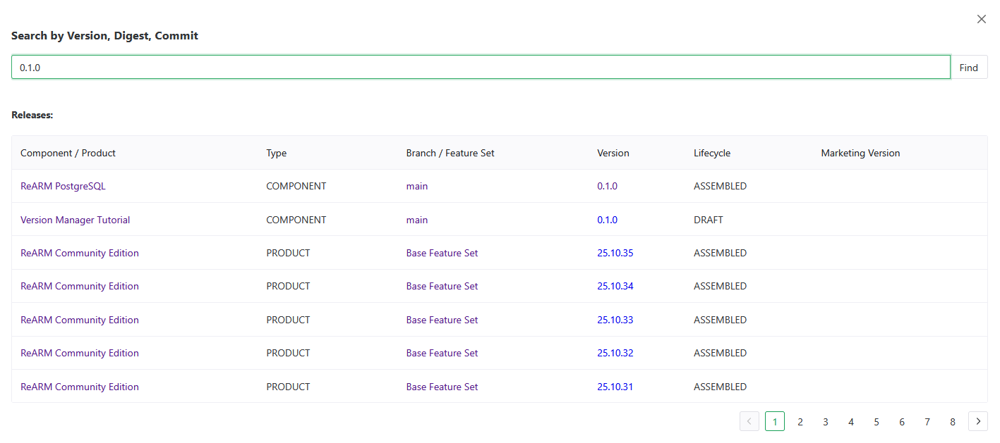
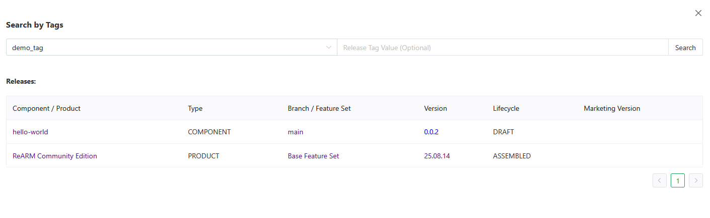
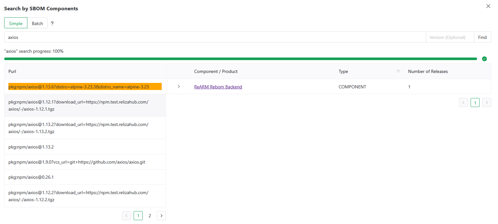
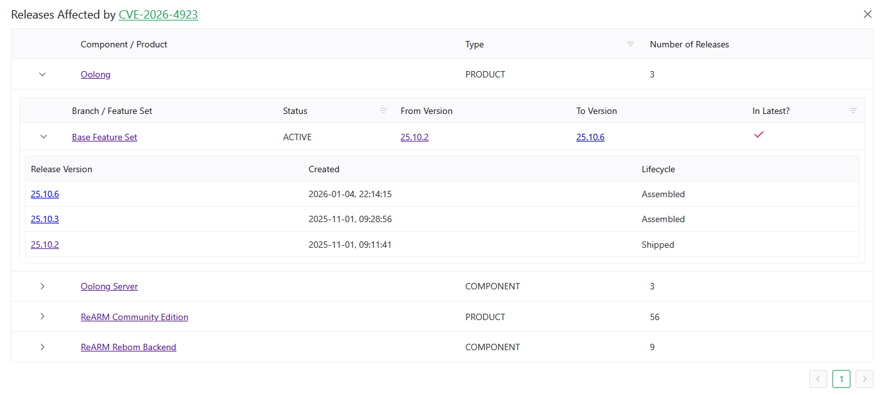

# Supply Chain Forensics

## Description

ReARM's Supply Chain Forensics capabilities allow you to trace the impact of specific dependencies, vulnerabilities, weaknesses, or violations across your entire organization's release portfolio. Instead of manually checking each component, you can search across all releases at once to answer questions like:

- Which releases are affected by a specific CVE?
- Which releases include a particular SBOM component (i.e., a compromised library) by name or PURL?

Search functionality is available on the **Home** page in the **Search Releases** widget.

## Prerequisites

Searching by SBOM components requires a working [Dependency-Track integration](../integrations/dtrack). Other types of search work natively without any additional setup.

## Search Modes

The Search Releases widget on the Home page provides four search tabs.

### By Version, Digest, or Commit

Search for releases matching a specific version string, artifact digest, git commit hash, git tag, build ID, release UUID, artifact UUID, or deliverable UUID.

Enter the value in the search field and click **Find**. Results open in a modal showing matching releases with their component, branch, version, and lifecycle.



### By Tags

Search for releases that have a specific ReARM tag key and optional tag value.

1. Select a tag key from the dropdown (populated from your organization's release tags)
2. Optionally enter a tag value to narrow the search
3. Click **Search**

Results show all releases matching the tag criteria.



### By SBOM Components

Search for releases that contain a specific dependency in their SBOM. This is useful for answering **"which of our releases ship library X?"** - for example, when a new vulnerability is disclosed in a popular library before a CVE is assigned.

Refer to [Search Releases by SBOM Components](../tutorials/search-releases-by-sbom-components) for tutorial videos.

#### Simple Mode

Enter the component **name or PURL** and an optional **version** then click **Find**.

- **Name** - matches by package name, group, or full PURL (e.g., `lodash`, `@org/package`, `pkg:npm/lodash@4.17.21`)
- **Version** - optional, narrows results to a specific version

#### Batch Mode

Batch mode lets you search for multiple components at once. Click the **Batch** radio button to switch modes.

Enter one package per line. Each line can have an optional version separated by a tab:

```
lodash
express	4.18.2
@posthog/clickhouse
```

Alternatively, supply a JSON array:

```json
[
  {"name": "lodash", "version": "4.17.21"},
  {"name": "express"}
]
```

Large batches are automatically split into chunks of 100 and processed sequentially, with a progress indicator showing completion percentage.

#### Reading the Results

SBOM component search results open in a two-panel modal:

1. **Left panel - Matched PURLs** - lists each matched component PURL. Click a PURL row to load the releases that contain it.
2. **Right panel - Releases** - shows all components and their branches/releases that have the selected PURL in their SBOM. Each release row shows version, lifecycle status, and finding counts.



### By Findings (CVE, CWE, GHSA, etc.)

Search for all releases affected by a specific finding ID - a CVE, GHSA identifier, CWE weakness ID, or any other supported finding type.

When you switch to the **By Findings** tab, ReARM loads the current finding IDs active in your organization (or current perspective) into an autocomplete field. Start typing a CVE, CWE, or GHSA ID and select from the suggestions, or type a full ID manually.

Click **Find** to open the **Releases Affected** modal.

#### Releases Affected Modal

The modal shows all components with branches and releases in your organization that have the searched finding ID in their vulnerability or weakness data. For each component, the table shows:

- **Component / Product name** - linked to the component view
- **Branch / Feature Set** - listed under each component
- **Releases** on that branch - with version, lifecycle, and finding counts (critical / high / medium / low / unassigned vulnerabilities and policy violations)
- **Is Latest** column - indicates whether the release is the latest on its branch or feature set

CVE and GHSA IDs are linked to [OSV.dev](https://osv.dev) for external advisory details.

The finding search is also accessible from the **Finding Analysis** page - click the **eye icon** on any Vulnerability-type analysis record to open the same modal filtered to that CVE.



## Perspective Filtering (ReARM Pro)

All search modes respect the currently selected **Perspective**. If a perspective is active, results are scoped to the components and releases within that perspective. The modal title includes the perspective name when filtering is active.

## Typical Use Cases

### Triage a Newly Disclosed CVE

1. Go to **Home → Search Releases → By Findings**
2. Enter the CVE ID (e.g., `CVE-2026-4923`)
3. Review the **Releases Affected** modal to see which branches have the vulnerability on their latest release
4. Navigate directly to each affected release to create a [Finding Analysis](./auditing-findings) record

### Identify Exposure to a Vulnerable Library Before CVE Assignment

1. Go to **Home → Search Releases → By SBOM Components**
2. Enter the library name (e.g., `axios`) and the vulnerable version (e.g., `1.14.1`)
3. Review the matched PURLs and click through to see which releases contain that exact version. If no releases are found, the library is not discovered in your organization or perspective if one is active
4. Coordinate mitigation actions, patching, or create triage records as needed

### Audit Which Releases Ship a Specific Dependency Version

1. Use **Batch Mode** in the SBOM Components tab
2. Paste a list of library names (with optional versions) from a known-vulnerable lockfile
3. Review all matched releases across the organization in a single search
